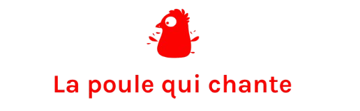

  

# 🐔 La Poule qui Chante – Étude de marché pour l’exportation internationale

## 📌 Contexte
**La Poule qui Chante** est une entreprise française d’agroalimentaire qui souhaite se développer à l’international en exportant ses poulets.  

À ce stade, aucun pays ni continent n’est encore ciblé : **tous les marchés sont envisageables**.  
L’objectif est de réaliser une première analyse des pays à fort potentiel afin de préparer une stratégie d’exportation.

---

## 🎯 Objectifs de la mission
- Identifier les **groupements de pays** favorables à l’exportation de volaille.  
- Réaliser une **analyse exploratoire** des données internationales.  
- Mettre en place une **classification et un clustering** pour segmenter les pays.  
- Produire des **visualisations et recommandations stratégiques**.  

---

## 📂 Données
- Source : **FAO – Food and Agriculture Organization**  
- Fichier fourni : *Données New Food Balances (FAO)*  
- Possibilité d’élargir l’analyse avec d’autres données en open data (ex. critères PESTEL).  

---

## 🛠️ Méthodologie
1. **Préparation et nettoyage** des données.  
2. **Analyse exploratoire** pour comprendre la structure et les tendances.  
3. **Clustering hiérarchique** (classification ascendante avec dendrogramme).  
4. **Méthode des k-means** pour affiner la segmentation et comparer les résultats.  
5. **ACP (Analyse en Composantes Principales)** pour visualiser les regroupements et interpréter les relations entre variables et individus.  

---

## 🛠️ Outils utilisés
- **Python** (Pandas, Matplotlib, Seaborn, Scikit-learn) ou **R** (tidyverse, FactoMineR, ggplot2).  
- **Jupyter Notebook / R Notebook** pour la préparation et l’analyse.  

---

## 📊 Résultats attendus
- Un **notebook documenté** présentant la préparation, le nettoyage et l’analyse exploratoire.  
- Un **notebook complémentaire** avec les méthodes de clustering et les visualisations associées.  
- Une **présentation synthétique** incluant :  
  - le contexte et la démarche,  
  - les méthodes employées,  
  - les résultats et recommandations stratégiques.  

---

## ✍️ Auteur
Projet réalisé par **Brahim LARAKI** dans le cadre de mon portfolio Data Analyst.
